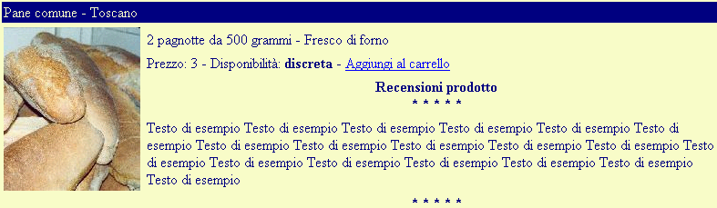

# UrbinoShop PHP - Guida

## Impostazioni 


### 1. Obiettivi generali
Si intende costruire un sito di e-commerce di prodotti alimentari suddivisi in categorie.

Il sito prevede la consultazione di un catalogo prodotti memorizzato su database Access con la possibilità di compiere una ricerca per nome, la registrazione degli utenti su database permette di comporre un carrello della spesa, memorizzato anch’esso su database, e di ordinare i prodotti raccolti nel carrello.

E’ prevista anche un’area amministrativa che permetta, ai soli utenti autorizzati, di gestire il catalogo prodotti e gli utenti registrati da postazione remota.

### 2. Definizione della struttura del sito
Creare una cartella “UrbinoShop” sul disco locale e realizzare al suo interno la seguente struttura di file e cartelle:

UrbinoShopPhp
- ¦   categoria_catalogo.php
- ¦   generale.css
- ¦   index.php
- ¦   prodotto_catalogo.php
- ¦   prodotto_dettagli.php
- ¦   prodotto_ricerca.php
- ¦   utente_carrello.php
- ¦   utente_carrello_aggiorna.php
- ¦   utente_login.php
- ¦   utente_logout.php
- ¦   utente_reg.php
- ¦+---admin
	- ¦ adminLogin.php
	- ¦ adminLogout.php
	- ¦ +---ssi
		- ¦ footer.php
		- ¦ header.php
- +---immagini
	- ¦ bevande.jpg
	- ¦ birrablack.jpg
	- ¦ birralager.jpg
	- ¦ casciotta.jpg
	- ¦ cioccofondente.jpg
	- ¦ cioccolatte.jpg
	- ¦ dolci.jpg
	- ¦ formaggi.jpg
	- ¦ gelato.jpg
	- ¦ logo.jpg
	- ¦ logoTesto.gif
	- ¦ pane.jpg
	- ¦ panespeciale.jpg
	- ¦ panetoscano.jpg
	- ¦ pecorinoromano.jpg
	- ¦ vinobianco.jpg
	- ¦ vinorosso.jpg
- +---ssi
	- ¦ autentica.php
	- ¦ Carrello.php
	- ¦ footer.php
	- ¦ header.php
	- ¦ shop_mysqli_funzioni.php
	- ¦ shop_mysql_costanti.php

I file di estensione ".php" sono semplici file di testo quindi possono essere gestiti con qualsiasi editor, le immagini della cartella omonima vanno realizzate a parte utilizzando un software specifico (o trovate su Internet), il database "urbino_shop" va creato con MySQL.

### 3. Impostazione del server web

Per testare il sito in locale è necessario istallare la combinazione: Apache - MySQL - PHP.
Un modo semplice per farlo su un PC di sviluppo Windows è [EasyPHP](http://www.easyphp.org/).

### 4. Creazione del database MySQL

Creare il database "urbino_shop" con MySQL (utilizzeremo lo strumento phpMyAdmin fornito con EasyPHP).

#### 4.1. Tabelle

Al database vanno aggiunte le seguenti tabelle:
- tblCategoria

| Nome        | Tipo     | Note           |   
| ----------- | -------- | -------------- |  
| IDcategoria |Contatore |Chiave primaria |  
| Nome        |Testo     |                |  
| Descrizione |Memo      |                |
| Foto        |Testo     |                |  

- tblProdotto

| Nome       | Tipo       | Note           |   
| ---------- | ---------- |--------------- |  
| IDprodotto |Contatore   |Chiave primaria |  
| IDcategoria|Intero lungo|                |  
| Nome       |Testo       |                |  
| Descrizione|Memo        |                |  
| Foto       |Testo       |                |  
| Prezzo     |Valuta      |                |  
| Disponibile|Testo       |                |  


- tblUtente

| Nome       | Tipo       | Note           |   
| ---------- | ---------- |--------------- |  
| IDutente   |Contatore   |Chiave primaria |  
| UserName   |Testo       |                |  
| Password   |Testo       |                |  
| Ruolo      |Intero lungo|                |  
| Nome       |Testo       |                |  
| Indirizzo  |Testo       |                |  
| Email      |Testo       |                | 

- tblRuolo

| Nome        | Tipo     | Note           |   
| ----------- | -------- | -------------- |  
| IDruolo     |Contatore |Chiave primaria |  
| Ruolo       |Testo     |                |  

- tblCarrello

| Nome        | Tipo        | Note           |   
| ----------- | ----------- | -------------- |  
| IDutente    |Intero lungo |Chiave primaria |  
| IDprodotto  |Intero lungo |Chiave primaria |  
| Qta         |Intero       |                |  

- tblOrdine

| Nome        | Tipo        | Note           |   
| ----------- | ----------- | -------------- |  
| IDordine    |Contatore    |                |  
| IDutente    |Intero lungo |Chiave primaria |  
| IDprodotto  |Intero lungo |Chiave primaria |
| Qta         |Intero       |                |

Come si vede, si è usato un campo contatore per la maggior parte delle chiavi primarie delle tabelle. Si tratta di una scelta dettata dalla rapidità di sviluppo.

#### 4.2. Dati di esempio

Popolare le tabelle con i seguenti dati di esempio:

- tblCategoria

| IDcategoria| Nome     | Descrizione                                |Foto                 |   
| -----------| -------- | ------------------------------------------ |-------------------- |
|          1 |Bevande   |Bibite analcoliche, caffè, tè e birra       |immagini/bevande.jpg | 
|          2 |Dolci     |Dessert, caramelle e dolci                  |immagini/dolci.jpg   |  
|          3 |Pane      |Pane tipico da ciascuna regione italiana    |immagini/pane.jpg    |  
|          4 |Formaggi  |Formaggi tipici italiani, francesi, svizzeri|immagini/formaggi.jpg|


- tblProdotto

| IDprodotto | IDcategoria | Nome                 | Descrizione                               |Foto                       |Prezzo|Disponibile|
| ---------- | ----------- |----------------------| ------------------------------------------|---------------------------|------|-----------|  
|  1         | 1           | Birra lager          | Birra chiara 33cl di importazione         |immagini/birralager.jpg    |  2,55|elevata    |  
|  3         | 1           | Birra black          | Birra scura 33cl di produzione propria    |immagini/birrablack.jpg    |  3,50|buona      |  
|  4         | 2           | Gelato artigianale   | 3 Gusti frutta 1,5kg                      |immagini/gelato.jpg        |  2,50|buona      |  
|  5         | 2           | Gelato industriale   | 3 Gusti crema 2,5kg                       |immagini/gelato.jpg        |  2,00|buona      |  
|  6         | 2           | Cioccolato fondente  | 2 tavolette da 300 grammi                 |immagini/cioccofondente.jpg|  5,00|discreta   |  
|  7         | 2           | Cioccolato al latte  | 3 tavolette da 250 grammi                 |immagini/cioccolatte.jpg   |  4,50|buona      |  
|  8         | 1           | Vino rosso novello   | 12 bottiglie da 1 litro (Italia)          |immagini/vinorosso.jpg     | 12,00|elevata    |  
|  9         | 1           | Vino bianco novello  | 12 bottiglie da 1 litro (Italia)          |immagini/vinobianco.jpg    | 11,00|buona      |  
| 10         | 1           | Vino rosso - Merlot  | 6 bottiglie da 1 litro (Italia)           |immagini/vinorosso.jpg     | 24,00|discreta   |  
| 11         | 1           | Vino rosso - Barbera | 6 bottiglie da 1 litro (Italia)           |immagini/vinorosso.jpg     | 24,00|discreta   |  
| 12         | 3           | Pane comune - Toscano| 2 pagnotte da 500 grammi - Fresco di forno|immagini/panetoscano.jpg   |  3,00|discreta   |  
| 13         | 3           | Pane speciale - Olio | 4 pagnotte da 250 grammi - Fresco di forno|immagini/panespeciale.jpg  |  6,00|discreta   |  
| 14         | 4           | Pecorino romano      | 1 forma da 3 kg                           |immagini/pecorinoromano.jpg| 12,00|buona      | 
| 15         | 4           | Casciotta urbinate   | 1 forma da 2 kg                           |                           | 10,00|buona      | 

- tblUtente

| IDutente | UserName | Password  | Ruolo |Nome                   |Indirizzo|Telefono|Email                |
| -------- | -------- |-----------| ----- | --------------------- |---------|--------|---------------------|
|        1 | Primo    | primo     |     2 |Primo Utente           |piazza   |        |primo@urbinoshop.it  |
|        2 | Admin    | admin     |     1 |Amministratore del sito|viale    |   6597 |secondo@urbinoshop.it|
|        3 | Quarto   | quarto    |     2 |Quarto Utente          |rio      |   5555 |quarto@urbinoshop.it |
|        4 | Caio     | tizio     |     2 |Signor Caio            |via      |   1111 |caio@errore.it       |


- tblRuolo

| IDruolo | Ruolo         | 
| --------| ------------- | 
|       1 |Amministratore |
|       2 |Cliente        |
|       3 |Servizio       |

### 5. Layout delle pagine

Le pagine del sito condividono lo stesso layout di base.

#### 5.1. Layout

Iniziamo da una pagina modello per il layout che chiameremo "layout.htm". Il modello prevede un a tabella di 3 righe, larghezza 100%.

Il codice HTML è il seguente:

```html
<html>
    <!-- header invisibile -->
    Header invisibile
<body>
    <table width="100%" border="1">
        <tr>
            <td>
                <!-- header visibile -->
                Header visibile
            </td>
        </tr>
        <tr>
            <td>
                <!-- corpo della pagina -->
                Corpo pagina
            </td>
        </tr>
        <tr>
            <td>
                <!-- footer -->
                Footer
            </td>
        </tr>
    </table>
</body>
</html>
```
#### 5.2. Header visibile

Questa sezione della pagina contiene un’immagine, il logo del sito ed il menu di navigazione orizzontale:


Il codice HTML è il seguente:

```html
<!-- header visibile -->
Header visibile
<table width="100%" border="0" cellpadding="5" cellspacing="0">
    <tr class="sfondo">
        <td width="10%" >
            
        </td>
        <td valign="bottom" colspan="3">
            
            <p>ATTENZIONE: questo è solo un esempio a scopo didattico:
            non è possibile ordinare nulla</p>
        </td>
    </tr>
    <tr>
        <td>&nbsp;</td>
        <td>
            <!-- menu di navigazione -->
            Menu di navigazione
            <table>
                <tr>
                    <td>
                        <a href="index.php" class="menu">Home</a>
                    </td>
                    <td>
                        <a href="utente_login.php" class="menu">Login</a>
                    </td>
                    <td>
                        <a href="utente_logout.php" class="menu">Logout</a>
                    </td>
                    <td>
                        <a href="categoria_catalogo.php" class="menu">Categorie</a>
                    </td>
                    <td>
                        <a href="prodotto_ricerca.php" class="menu">Ricerca</a>
                    </td>
                    <td>
                        <a href="utente_carrello.php" class="menu">Carrello</a>
                    </td>
                    <td>
                        <a href="admin/adminLogin.php" class="menu">Amministra</a>
                    </td>
                </tr>
            </table>
        </td>
    </tr>
</table>
<hr>
```

#### 5.3. Header invisibile

Questa sezione della pagina contiene il tag head, andrebbe personalizzata per le singole pagine che compongono il sito ma, per semplicità di sviluppo, la manterremo invariata.

Il codice HTML relativo è il seguente:
```html
<!-- header invisibile -->
Header invisibile
<head>
    <title>UrbinoShop</title>
    <link rel="stylesheet" href="generale.css" />
    <meta name="description" content="Esempio di sito e-commerce in PHP" />
    <meta name="keywords" content="PHP, e-commerce, tutorial" />
</head>
```

#### 5.4. Footer

Questa sezione della pagina contiene un menu secondario ed una scritta di esempio:


Il codice HMTL relativo è:

```html
<!-- footer -->
Footer
<hr>
<table border="0">
    <tr>
        <td>
            <a href="carrello_sp_con_parametri.php">SP a parametro: carrello</a>
        </td>
        <td>
            <a href="utenti_sp_con_parametri.php">SP a parametro: utenti</a>
        </td>
        <td>
            <a href="mailto:informazioni@urbinoshop.com">Contattaci</a>
        </td>
        <td>
            &nbsp;
        </td>
        <td width="50%">
            &nbsp;
        </td>
    </tr>
    <tr>
        <td colspan="10">
            Copyright © 1995-2004 UrbinoShop Inc. Tutti i diritti riservati.
            Marchi registrati e segni distintivi sono di propriet&agrave; dei rispettivi titolari.
            L'uso di questo sito web implica l'accettazione dell'<a href="accordo.htm">Accordo</a>
            per gli utenti di UrbinoShop e delle <a href="privacy.htm">Regole</a> sulla privacy.
        </td>
    </tr>
</table>
```

### 6. Le Server-Side Include

Le pagine "header.php" e "footer.php" della cartella "ssi" non sono delle vere e proprie pagine php e neppure html ma contengono solo una parte di codice che si intende condividere fra tutte le pagine del sito.
In particolare la pagina "header.php" raccoglie il codice dell’header visibile e di quello invisibile, oltre ai tag html e table di apertura della pagina mentre la pagina "footer.php" contiene il codice del footer oltre ai tag table e html di chiusura della pagina.
Vanno usate sempre insieme poiché la prima apre la tabella principale della pagina mentre l’ultima la chiude.
Per inserire le due SSI in ciascuna pagina si utilizza il codice seguente:

```php
<?php include("ssi/header.php") ?>
    <!-- corpo della pagina -->
<?php include("ssi/footer.php") ?>
```

Le pagine che includono le SSI devono avere un’estensione particolare affinché il server le elabori.
Ogni volta che si caricherà la pagina principale nel browser, il server web (Microsoft IIS nel nostro caso) unirà la SSI alla pagina principale.

La cartella "admin\ssi" contiene due pagine omonime che vengono utilizzate per le pagine dell’area amministrativa e sono in tutto simili a quelle presentate in questo paragrafo ma contengono un menu di navigazione diverso e dei path diversi per le istruzioni "include".

### 7. Stili CSS

Per garantire uno stile di formattazione uniforme a tutte le pagine del sito si utilizza il foglio di stile CSS "generale.css" che rispetta lo standard di formattazione "CSS livello 1".

Questo foglio può essere modificato a piacimento per personalizzare l’aspetto di tutte le pagine del sito a patto di non modificare o eliminare i nomi delle classi.


Il codice CSS, per il nostro esempio, verrà impostato nel modo seguente:

```css
body {
    background-color: Navy;
    color: Navy;
}
table.sfondo {
    background-color: #FFFFCC;
    color: Navy;
}
tr.sfondo {
    background-color: Navy;
    color: #FFFFCC;
}
a.menu:link, a.menu:visited {
    font-size: x-small;
    text-decoration : none;
    font-family : Arial, Helvetica, sans-serif;
    border-style : outset;
    padding : 1px;
    width : 90px;
    text-align : center;
    display : block;
}
a.menu:hover {
    border-style : inset;
}
```

## Codice di applicazione (PHP)
### 8. Pagine di accesso
#### 8.1. Home page

Si crei una semplice pagina "index.php" che contenga i collegamenti alle pagine di login, "utente_login.php", e di registrazione, "utente_reg.php".


Tale pagina risulta abbastanza *scarna* ma potrebbe essere arricchita facilmente aggiungendo la vetrina dei prodotti in promozione e altre iniziative speciali.

#### 8.2. Pagina di login

Creare la pagina "utente_login.php" che integra un modulo per l’inserimento dello UserName e della Password, il codice necessario ad effettuare il login ed un collegamento alla pagina di registrazione per gli utenti che ne sono sprovvisti.


#### 8.3. Logout

La pagina "utente_logout.php" non produce risultati *visibili* per l’utente ma è concepita esclusivamente per permettergli di interrompere esplicitamente la propria sessione e riportarlo alla pagina di login.

#### 8.4. Registrazione

Se l’utente non possiede già una registrazione valida può effettuarla per mezzo della pagina "utente_reg.php" che integra un modulo di raccolta dati:


La pagina elabora la registrazione sul database ed informa l’utente circa l’esito dell’operazione.

### 9. Catalogo on-line
#### 9.1. Catalogo categorie

La pagina "categoria_catalogo.php" visualizza l’elenco delle categorie di prodotti disponibili permettendo di scegliere la categoria di cui visualizzare il dettaglio attraverso il collegamento "Visualizza Prodotti".


#### 9.2. Catalogo prodotti

La pagina "prodotto_catalogo.php" visualizza l’elenco dei prodotti appartenenti alla categoria selezionata dall’utente.


Il collegamento “Dettagli” permette di passare alla pagina di dettaglio sul singolo prodotto.

#### 9.3. Dettagli sul prodotto

La pagina “prodotto_dettagli.php” visualizza le informazioni dettagliate sul prodotto selezionato dall’utente e gli permette di aggiungerlo al proprio carrello della spesa ma solo dopo aver effettuato il login.



#### 9.4. Ricerca di un prodotto

La pagina "prodotto_ricerca.php" permette di cercare un prodotto per nome.

Non è necessario indicare il valore esatto del prodotto.

I risultati della ricerca eseguita vengono presentati nella stessa pagina con l’indicazione dei parametri utilizzati per la ricerca:


### 10. Acquisti
#### 10.1. Autenticazione dell’utente

Solo dopo il login l’utente potrà utilizzare il carrello della spesa e accedere ad alcune pagine collegate. Per limitare il diritto di accesso alle pagine desiderate si utilizza il codice della pagina "autentica.php" memorizzata nella cartella "ssi".

Questa pagina va inclusa in tutte quelle che hanno un contenuto *privato* per mezzo dell’istruzione:

```php
<?php include("ssi/autentica.php"); ?>
```

#### 10.2. Carrello

La pagina "utente_carrello.php" permette all’utente loggato di visualizzare il contenuto corrente del proprio carrello e gli consente di modificarne il contenuto, modificare la quantità di un prodotto già presente o eliminare un prodotto, e di procedere con l’ordine.


#### 10.3. Carrello - Aggiornamento

La pagina "utente_carrello_aggiorna.php" non possiede un’interfaccia ma tutto il codice di gestione del carrello. Il codice utilizza i metodi della classe "carrello.php".

#### 10.4. Ordine (non implementato)

La pagina "utente_ordine.php" permette all’utente loggiato di visualizzare il proprio ordine per decidere  se annullare o procedere con la conferma finale.


#### 10.5. Elaborazione dell’ordine (non implementato)

La pagina "utente_ordine_elabora.php" non possiede un’interfaccia utente ma tutto il codice per la gestione dell’ordine.

#### 10.6. Conferma dell’ordine (non implementato)

La procedura di conferma dell’ordine dovrebbe prevedere la scelta del metodo di pagamento, la conferma dei dati anagrafici che l’utente ha fornito in fase di registrazione, la raccolta dei dati necessari per il pagamento e l’invio dei dati ad un fornitore di servizi di pagamento elettronico esterno.

Tale procedura richiede la decisione, da parte del proprietario del sito e-commerce, dei metodi di pagamento accettati e dei sistemi di invio della merce previsti nonché la stipula di un contratto con il fornitore di servizi. 
Per questo viene tralasciata. La pagina "utente_ordine_conferma.php" contiene, infatti, solo un semplice codice di conferma dell’avvenuto ordine.

### 11. Classi e librerie di funzioni PHP

Si sono utilizzate alcune classi e librerie di funzioni definite in PHP per raggruppare le funzioni principali relative agli elementi fondamentali del sito.

#### 11.1. Connessioni MySQL

I file "shop_mysql_costanti.php" e "shop_mysqli_funzioni.php" contengono una libreria di funzioni personalizzate che molte pagine utilizzano per la connessione al database tramite la libreria dedicata msqli.

In particolare, "shop_mysql_costanti.php" definisce una serie di costanti descrittive del database mentre il file "shop_mysqli_funzioni.php" contiene la definizione di tutte le funzioni necessarie.

#### 11.2. Carrello e Carrello_dettagli

La pagina "carrello.php" contiene la definizione delle classi **Carrello** e **Carrello_dettagli** che alcune pagine utilizzano per la gestione del carrello della spesa.

La classe **Carrello_dettagli** raccoglie tutte le proprietà descrittive del carrello dell’utente (corrispondono ai campi della tabella "tblCarrello" del database) e un metodo per il controllo delle stesse mentre la classe **Carrello** integra tutti i metodi necessari per la gestione del carrello.
